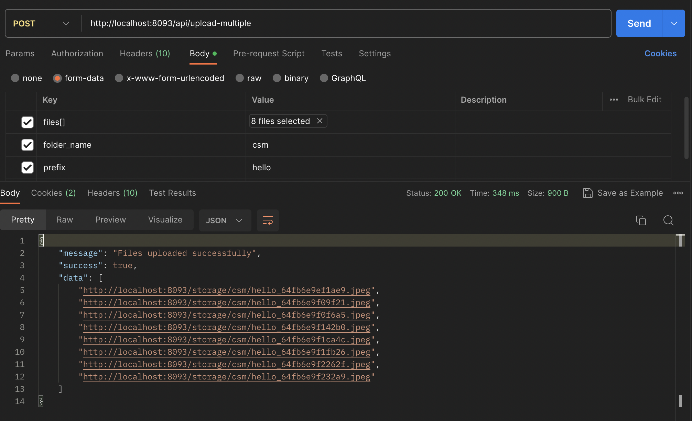

# KU Wongnai - File Storage

This service serve as a file storage for KU Wongnai project. It store images such as user avatar, restaurant, restaurant's menu, and more.

## Basic Usage

### Upload single file


Make a POST request to http://localhost:8093/api/upload with form-data body. The key must be `file` and the value must be a file with type of `jpeg,png,jpg,gif,svg` and not exceed 2 MB, then specify `file_name` that you want to save the file as.

### Upload multiple files



Make a POST request to http://localhost:8093/api/upload-multiple with form-data body. The key must be `files` and the value must be a file with type of `jpeg,png,jpg,gif,svg` and not exceed 2 MB, then specify `folder_name` that you want to save the file in. Optionally, you can specify `prefix` to add prefix to the file name.

## Setup

Install laravel dependencies

```sh
docker run --rm \
    -u "$(id -u):$(id -g)" \
    -v "$(pwd):/var/www/html" \
    -w /var/www/html \
    laravelsail/php82-composer:latest \
    composer install --ignore-platform-reqs
```

Copy `.env.example` to `.env`

Start the service

```sh
sail up -d
```

Link storage folder to public folder by running this command

```sh
sail artisan storage:link
```
